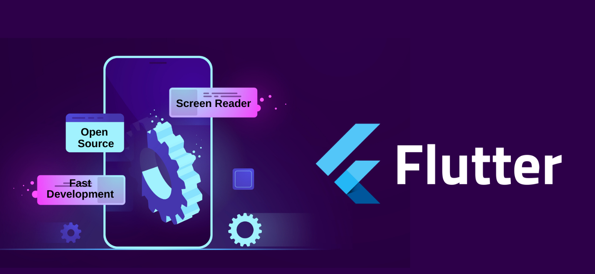

# Flutter Development Journey

**Learning Flutter and Building Apps**

  

## Overview

Throughout my journey of learning Flutter, I have developed a solid understanding of mobile application development using this powerful framework. Flutter's ability to create natively compiled applications for mobile, web, and desktop from a single codebase has enabled me to work on various exciting projects.

## Key Learnings

- **Flutter Fundamentals:** Gained proficiency in Flutter’s core concepts, including widgets, state management, and navigation.
- **Dart Programming:** Mastered Dart programming language essentials for building robust Flutter applications.
- **UI Design:** Acquired skills in designing responsive and visually appealing user interfaces using Flutter’s rich set of widgets and customizations.
- **State Management:** Implemented various state management solutions such as Provider and Riverpod to manage application state effectively.
- **API Integration:** Learned to integrate APIs to fetch and display dynamic data within applications.

## Projects

### 1. Dicee

- **Description:** A simple yet engaging dice-rolling app that simulates rolling two dice and displays the result.
- **Features:** Interactive dice animations, random number generation, and a sleek user interface.
- **Tech Stack:** Flutter, Dart.

### 2. Micard

- **Description:** A digital business card app that allows users to create and share virtual business cards.
- **Features:** Customizable card designs, contact information storage, and easy sharing options.
- **Tech Stack:** Flutter, Dart.

### 3. Coffee Shop

- **Description:** An app designed for coffee lovers to explore and order from various coffee shops.
- **Features:** Coffee menu, shop locator, and order management.
- **Tech Stack:** Flutter, Dart.

### 4. I Am Rich

- **Description:** A minimalistic app showcasing a simple yet elegant design for displaying a "rich" message.
- **Features:** Elegant UI, interactive design elements.
- **Tech Stack:** Flutter, Dart.

### 5. Namer App

- **Description:** An app that generates random names and provides users with a list of unique names.
- **Features:** Name generation algorithm, user-friendly interface.
- **Tech Stack:** Flutter, Dart.

### 6. Xylophone

- **Description:** An educational app that simulates a xylophone and allows users to play musical notes by tapping on the keys.
- **Features:** Interactive xylophone keys, sound effects.
- **Tech Stack:** Flutter, Dart.

## Skills Acquired

- **Widget Development:** Proficiency in creating and managing Flutter widgets to build functional and attractive user interfaces.
- **State Management:** Effective use of state management techniques to maintain and update application state.
- **API Integration:** Skills in integrating and utilizing external APIs within Flutter applications.
- **UI/UX Design:** Experience in designing intuitive and user-friendly interfaces.

## Resources

- **Official Flutter Documentation:** Referenced the Flutter documentation for in-depth guidance and best practices.
- **Dart Programming Guide:** Utilized Dart’s official programming guide to understand language features and functionalities.

## Conclusion

My experience with Flutter has been both challenging and rewarding. Developing a variety of applications has honed my skills in mobile app development and provided me with valuable insights into creating high-quality user experiences. I look forward to continuing my journey with Flutter and exploring more advanced features and techniques.

